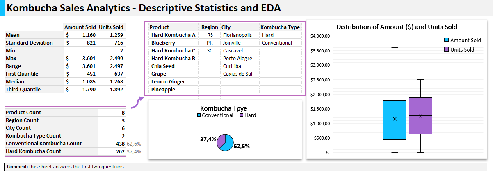
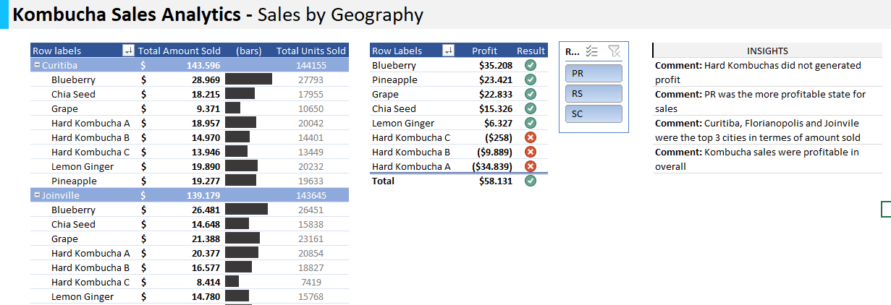

# ENGLISH-Portfolio

# **Kombucha Sales Analytics - Summary**

> **"Kombucha Kulture"**' is a growing kombucha startup that has just expanded its sales accross some regions and cities in the South of Brazil. However, the company's management team has noticed that some of their flavors are not performing as well as others. To handle this scenario, this MS Excel workbook is intended to analyze its sales data corresponding to January of 2023. 

* **Business Questions to be answered:**
							
1. How do the Amount and Units Sold are statistically described?							
2. How many products, regions, cities and kombucha types does the company have?							
3. How did the sales perfomed by geography?							
4. How did the sales perfomed by product?							
5. Are there outliers or anomalies in the kombucha sales dataset?							
6. Are there products that should be discontinuated?				

* **The Analysis** was performed and those questions were answered in a MS Excel workbook that was divided into the following sheets:

| Sheet	| Analysis |
|-------|----------|
| 2 	| Descriptive Statistics and EDA |
| 3 	| Sales by Geography |
| 4 	| Dynamic Report |
| 5 	| Anomaly Detection |
| 6 	| Products Discontinuation |

> **KEY INSIGHTS/BUSINESS QUESTIONS ANSWERS:**

1. How do the Amount and Units Sold are statistically described?

 
  

2. How many products, regions, cities and kombucha types does the company have?	**Sheet #2** 	

 
  

  
3. How did the sales perfomed by geography? 

 
  
 							
  
4. How did the sales perfomed by product? **Sheet #4 (Dynamic Report)**							
5. Are there outliers or anomalies in the kombucha sales dataset? **Sheet #4 (Anomaly Detection)** 							
6. Are there products that should be discontinuated?

